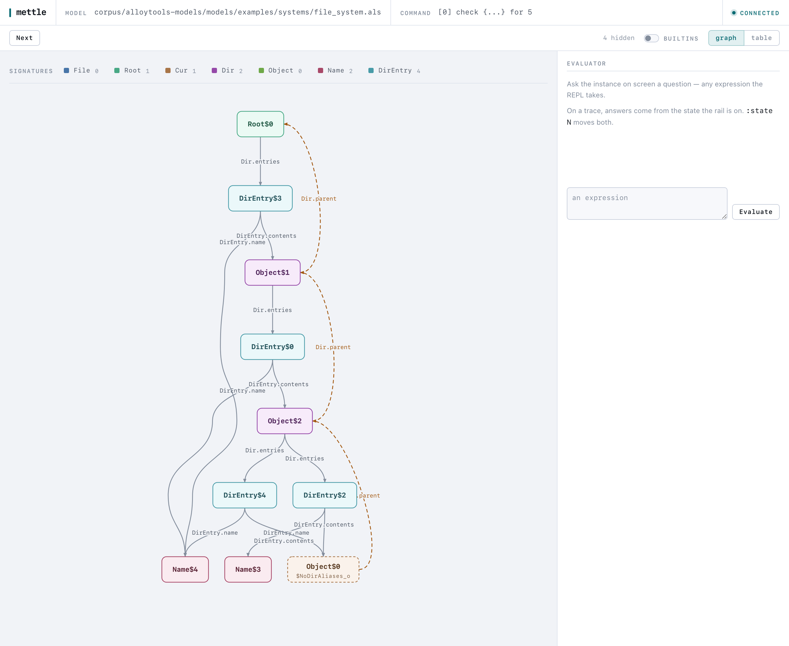
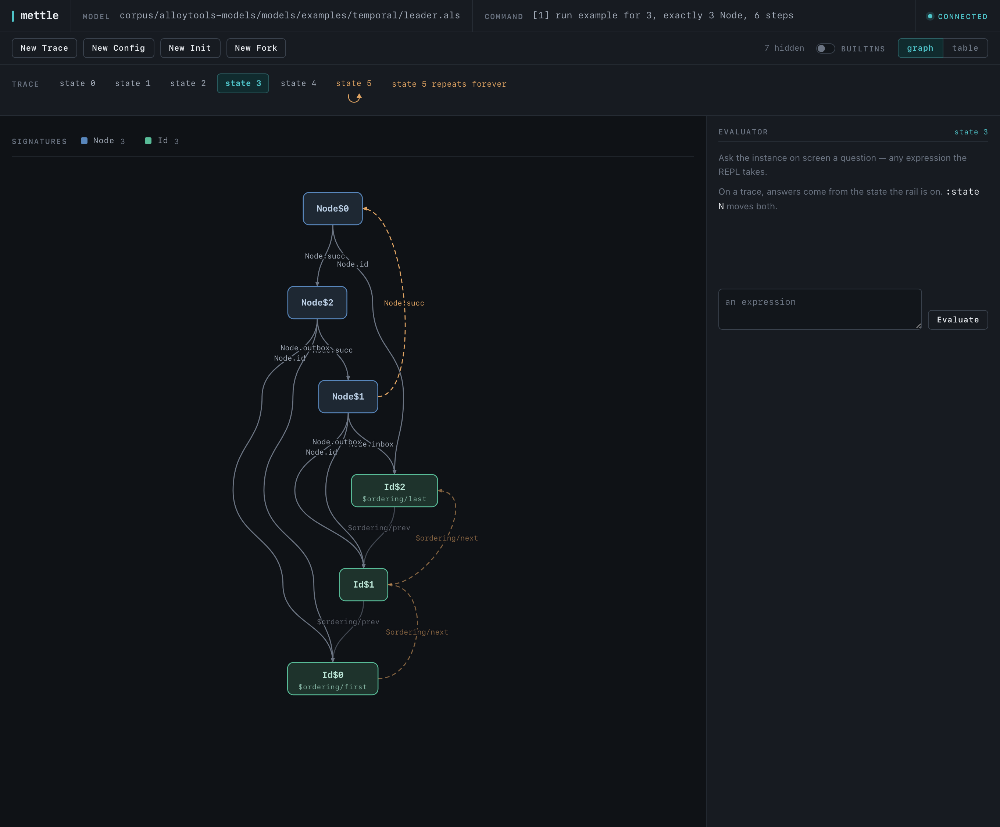

[](https://github.com/chaychoong/mettle/actions/workflows/ci.yml)
[](https://github.com/chaychoong/mettle/releases)

# mettle

mettle is a conformance-tested reimplementation of Alloy 6 in one self-contained binary. It needs no Java runtime. It reads standard `.als` files, the same language as the reference Alloy Analyzer. It finds instances and counterexamples, steps through temporal traces, and visualizes in the browser from a CLI. mettle tracks Alloy 6.2.0, the latest release of the reference implementation.

<picture>
  <source srcset="docs/screenshots/graph-dark.png" media="(prefers-color-scheme: dark)">
  
</picture>

mettle aims to replace Alloy without changing its behaviour. The conformance scorecard is the measure: each model that both tools execute must produce the same answer. When mettle cannot execute something, it reports `CANNOT EXECUTE` with a typed reason. It never guesses.

> mettle stays on version 0.x on purpose. It is not yet meant for production. The version number makes no claim about progress. The scorecard does. See [what it can and can't do yet](LIMITATIONS.md) and the [roadmap](docs/ROADMAP.md).

## Install

Binary releases support macOS arm64 and x86_64, and Linux arm64 and x86_64. They have no runtime dependencies.

```sh
brew install chaychoong/tap/mettle
curl -LsSf https://github.com/chaychoong/mettle/releases/latest/download/mettle-installer.sh | sh
nix run github:chaychoong/mettle -- --help
docker pull ghcr.io/chaychoong/mettle
```

Build from source with the toolchain version fixed by `rust-toolchain.toml`:

```sh
cargo build --release
```

`cargo install` from crates.io is deliberately not a channel.

mettle uses CaDiCaL. It builds from sources vendored in `vendor/cadical`; a source build needs a C++ toolchain. See the [solver decision](docs/adr/0027-cadical-only-solver.md). `exec` and `serve` take `--solver <name>`. `cadical` is the only accepted name today. [LIMITATIONS.md](LIMITATIONS.md) describes the costs.

## Try it

Run a model in Docker without an install:

```sh
docker run --rm -v "$PWD":/work ghcr.io/chaychoong/mettle exec /work/model.als
docker run --rm -p 4030:4030 -v "$PWD":/work ghcr.io/chaychoong/mettle serve /work/model.als --bind 0.0.0.0
```

Open http://localhost:4030 after you start `serve`.

## Commands

`mettle exec model.als` runs each run/check command to a verdict and renders instances and counterexamples. For an Alloy 6 temporal model, it searches for a lasso trace and prints each state with the loop marked.

`mettle exec model.als --repl` starts an evaluator REPL over the solved instance. For a temporal command, it acts as a trace debugger; `:state N` moves the evaluation point through the loop.

`mettle serve model.als` solves one command for exploration in the browser. It opens graph and table views, a trace rail, an evaluator pane, and New Trace / New Config / New Init / New Fork enumeration. It speaks the Sterling provider protocol, so external Sterling clients work too.



`mettle exec model.als --xml out.xml` writes the solved command as instance XML in the same byte shape as the jar's writer.

`mettle parse model.als` and `mettle check model.als` parse, resolve, and typecheck with rustc-style caret diagnostics.

## Conformance

The scorecard measures the committed corpora, alloytools-models plus portus-63: 167 files and 564 run/check commands. The figures below were measured on 2026-08-27. You can regenerate them from a checkout with the commands below. All results are deterministic and byte-identical across runs and machines.

The reference is the Alloy Analyzer 6.2.0 jar.

| Check | Result |
| --- | --- |
| Verdict agreement, SAT/UNSAT against the jar | 554 of 564 agree (290 SAT / 264 UNSAT), 0 disagreements |
| Self-check, each mettle instance re-verified by its independent evaluator | 0 failures |
| Counting, all solutions at small scopes against the jar | 71 exact matches at symmetry 0, 96 at symmetry 20, 0 mismatches |
| Syntax and resolution, lex, parse, print, re-parse, resolve, and typecheck against the jar | 167 of 167 files, 100% agreement |

Of the 10 remaining commands, mettle answers 2 where the jar times out, leaving nothing to compare. Two run past the default solve budget. Four are higher-order commands that the jar also errors on. Two are temporal commands that mettle rejects with the same text as the jar. The corpus produced 0 panics.

CaDiCaL can log a DRAT proof for an UNSAT verdict. An external checker can verify it against the CNF that mettle solved. See [CONTRIBUTING.md](CONTRIBUTING.md) for the recipe.

A differential pass over 150,891 snippets from [Alloy4Fun](https://github.com/haslab/Alloy4Fun) was measured on 2026-08-25. It found 0 disagreements in either direction and 100.0000% agreement. mettle rejects nothing the jar accepts and accepts nothing the jar rejects. Error positions match exactly on 99.79% of parse errors. Warning emission matches exactly: all 101,970 warning-bearing files are identical, and every one of the jar's 14,180 warnings matches by class and line.

A mutation fuzzer runs 4,248 mutants per CI run and has verified 88,500 offline. It checks for no panic, sane spans, and round-trip stability.

The [Semantics Ledger](SEMANTICS_LEDGER.md) records every matched behavioural rule. Every disagreement found has a root cause and a regression test.

## Benchmarks

[BENCHMARKS.md](BENCHMARKS.md) has the measured numbers. It covers startup, native binary against a cold JVM; parse and resolve over the whole corpus, about 21 times faster as batch wall clock; and per-command solving, mettle's CaDiCaL against the jar's default SAT4J. It states the caveats and asserts verdict agreement on every compared row.

## Regenerate the scorecard

```sh
./scripts/fetch-corpora.sh                                  # corpora are fetched, never committed
cargo build --release -p als-conform -p mettle
./target/release/solve-gauge --jobs 8                       # verdict sweep + self-check
./target/release/solve-gauge --count --jobs 8               # counting check, symmetry 0
./target/release/solve-gauge --count --count-symmetry 20 --jobs 8
cargo test --release -p als-syntax --test corpus_roundtrip  # syntax check
```

## Found a difference from Alloy

A model that disagrees with the Alloy Analyzer is a valuable contribution. Any difference is a mettle bug. This includes a different verdict or error, accepting a model the Alloy Analyzer rejects, rejecting a model it accepts, or a differing trace or evaluator answer.

Check [LIMITATIONS.md](LIMITATIONS.md) first. It lists each known gap and deliberate divergence. A `CANNOT EXECUTE` report declines an answer; it is not a disagreement.

File an issue with the smallest `.als` that shows the problem, the exact command, what Alloy 6.2.0 says, what mettle says, and `mettle --version` output. Use the [divergence issue form](https://github.com/chaychoong/mettle/issues/new?template=divergence.md). Shrinking the model is welcome but optional. Each confirmed divergence gets a root cause and a regression test.
